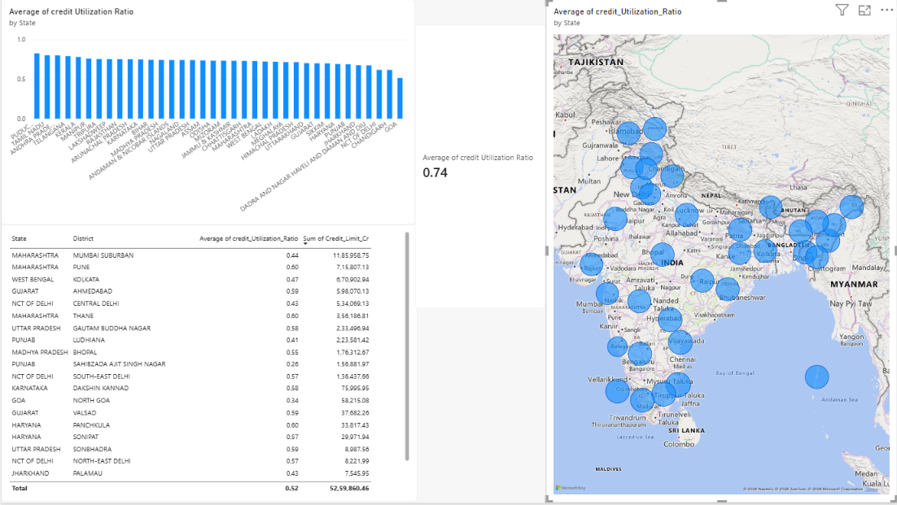
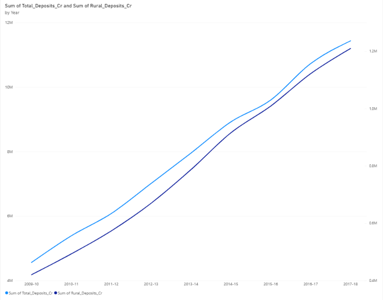

# Rural Credit Utilization & Deposit Trends in India (2009–2024)

A SQL and Power BI analysis of district-level bank credit and deposit data from the Reserve Bank of India (RBI) to evaluate credit absorption, identify systemic disbursement bottlenecks, and formulate actionable rural credit policy recommendations.

---

## 📌 Project Motivation

Most credit-access analyses stop at the aggregate Credit-to-Deposit (C-D) ratio. This project investigates a more granular operational question: **within credit already sanctioned to a district, how much of it is actually drawn down?**

A district can appear credit-served on paper while still facing real-world barriers—such as awareness gaps, disbursement friction, and documentation hurdles—that leave sanctioned funds idle. Pinpointing this gap highlights where high-leverage interventions like doorstep banking, SHG-linked credit camps, and targeted financial literacy drives can maximize the impact of rural banking infrastructure.

---

## 📂 Data Sources

* **Bank Credit of SCBs (District-wise, 2019–2024):** Number of accounts, credit limit sanctioned, and amount outstanding.
* **Bank Deposits of SCBs (District-wise, 2009–10 to 2017–18):** Deposit accounts and balances categorized by population tier (rural, semi-urban, urban, metropolitan).
* **Source:** Reserve Bank of India Database on Indian Economy ([data.rbi.org.in](https://data.rbi.org.in)).

> **Note:** Because the credit and deposit series on the RBI portal do not have overlapping time periods, they are structured into two complementary analytical tracks: historical deposit mobilization (2009–2018) and contemporary credit absorption (2019–2024).

---

## 🛠️ Technical Implementation

### 1. SQL Analytics (`credit_analysis_queries.sql`)
* **Schema Transformation:** Reshaped raw wide-format RBI exports into a clean, long-format relational schema (`District`, `Year`, metric columns).
* **Metric Engineering:** Formulated the primary evaluation metric:
  $$\text{Credit Utilization Ratio} = \frac{\text{Amount Outstanding}}{\text{Credit Limit Sanctioned}}$$
* **Core Query Workflows:**
  * Top and bottom $N$ district rankings.
  * State-level aggregations using `GROUP BY`.
  * Year-over-Year (YoY) growth calculations using self-joins.
  * Intra-state relative performance rankings using window functions (`RANK() OVER (PARTITION BY State ORDER BY Utilization_Ratio DESC)`).
  * Priority-flag filtering logic for high-sanctioned, low-utilization districts.

### 2. Power BI Dashboard (`rural_credit_analysis.pbix`)
* **State-Level Comparisons:** Bar charts comparing mean utilization ratios across states.
* **Choropleth Mapping:** Geospatial visualization of regional credit absorption patterns.
* **Policy Priority Matrix:** Interactive table isolating districts with high credit limits but low drawdowns.
* **Longitudinal Trends:** Deposit mobilization patterns across the 2009–2018 financial inclusion period.

*State-level utilization ratios, district drilldown table, and geographic distribution across India.*

*Total vs. rural deposit growth, 2009-10 to 2017-18, showing steady financial inclusion gains.*

---

## 🔍 Key Findings

* **National Absorption Gap:** The all-India average credit utilization stands at **0.74**, indicating that roughly 26% of sanctioned rural and semi-urban credit remains undrawn.
* **Regional Divergence & SHG Strength:** Southern states (notably Tamil Nadu and Puducherry) dominate the highest-utilization tier, reflecting well-integrated Self-Help Group (SHG) bank linkage models. Conversely, several northern and highly industrialized districts show significantly lower utilization rates.
* **Target Intervention Clusters:** Identified a distinct cluster of districts with above-average sanctioned credit limits paired with utilization rates below **0.60**. In these regions, credit infrastructure is already in place, but operational friction impedes fund deployment.
* **Inclusion vs. Absorption:** Rural deposits expanded consistently from 2009–10 to 2017–18 (accelerated by the PMJDY rollout). The fundamental constraint is not banking access or deposit accumulation, but rather credit absorption friction on the borrower end.

---

## 🏛️ Policy Recommendations

Public policy should shift focus from credit *sanctioning targets* to credit *distribution and absorption*:

* **Scale Southern SHG Linkage Models in Northern States:** Expand SHG-bank linkage programs across northern districts to bridge information asymmetry, improve financial literacy, and accelerate loan disbursement.
* **Modernize Primary Agricultural Credit Societies (PACS):** Modernize and digitize PACS in key agricultural hubs (such as Punjab and Haryana) to streamline the delivery of short-term crop credit and reduce grassroots disbursement friction.
* **Direct Credit Toward Post-Harvest & Processing Infrastructure:** Sanction credit lines for cold chains, storage, and agro-processing units. This reduces the post-harvest idle period for credit and helps diversify rural household income streams.

---

## ⚙️ Tools & Reproduce

**Tools used:** SQL Server (T-SQL), Power BI Desktop

**To reproduce:**
1. Import the two CSVs from `/data` as tables named `CreditData` and `DepositsData` in your SQL environment.
2. Run `credit_analysis_queries.sql` against them to generate the analytical views.
3. Open `rural_credit_analysis.pbix` in Power BI Desktop and refresh the data connections to point to your local tables.
